```mermaid
graph LR
    A[🤔 Want to Contribute?] --> B{Choose Your Path}
    
    B --> C[📚 Content Creator]
    B --> D[💻 Developer]
    B --> E[🎨 Designer]
    B --> F[📖 Technical Writer]
    
    C --> G[Share Resources]
    C --> H[Rate & Review]
    
    D --> I[Fix Bugs]
    D --> J[Add Features]
    D --> K[Improve Performance]
    
    E --> L[UI/UX Design]
    E --> M[Create Graphics]
    
    F --> N[Write Docs]
    F --> O[Create Tutorials]
    
    G --> P[🎉 Become a Contributor]
    H --> P
    I --> P
    J --> P
    K --> P
    L --> P
    M --> P
    N --> P
    O --> P
    
    style A fill:#FFD700
    style P fill:#32CD32
    style B fill:#87CEEB
```

```mermaid
sequenceDiagram
    participant You
    participant Fork
    participant PR as Pull Request
    participant CI as CI/CD
    participant Main as Main Repo
    
    You->>Fork: 1. Fork Repository
    You->>Fork: 2. Clone & Create Branch
    You->>Fork: 3. Make Changes
    You->>Fork: 4. Test Locally
    You->>Fork: 5. Commit & Push
    Fork->>PR: 6. Open Pull Request
    PR->>CI: 7. Run Automated Checks
    CI->>PR: 8. Report Results
    PR->>Main: 9. Review & Merge
    Main->>You: 10. 🎉 Contribution Accepted!
    
    Note over You,Main: Thank you for contributing!
```

# 🎓 EduKit Africa

<div align="center">
  
  

  
  
  **Open Source African Tech Learning Platform**
  
  [](https://choosealicense.com/licenses/mit/)
  [](http://makeapullrequest.com)
  [](https://www.typescriptlang.org/)
  [](https://reactjs.org/)
  [](https://vitejs.dev/)
  [](https://supabase.com/)
  
  
  
  
  [🌐 Live Demo](https://afri-skill-forge.vercel.app) · [🐛 Report Bug](https://github.com/mwakidenis/EduKit-Africa/issues) · [💡 Request Feature](https://github.com/mwakidenis/EduKit-Africa/issues) · [🤝 Join Discord](#contact)
</div>

---

## 📖 Table of Contents

- [About the Project](#-about-the-project)
- [Features](#-features)
- [Tech Stack](#️-tech-stack)
- [System Architecture](#️-system-architecture)
- [Getting Started](#-getting-started)
  - [Prerequisites](#prerequisites)
  - [Installation](#installation)
  - [Environment Variables](#environment-variables)
- [Database Schema](#️-database-schema)
- [Usage](#-usage)
- [Contributing](#-contributing)
  - [Ways to Contribute](#-ways-to-contribute)
  - [Code Contribution Quick Start](#-code-contribution-quick-start)
  - [Priority Areas](#-priority-areas-for-contribution)
- [Join Our Community](#-join-our-community)
- [Code of Conduct](#-code-of-conduct)
- [Security](#-security)
- [Roadmap](#️-roadmap)
- [License](#-license)
- [Contact & Community](#-contact--community)
- [Acknowledgments](#-acknowledgments)
- [Good First Issues](#-good-first-issues)

---

## 🌍 About the Project

**EduKit Africa** is an open-source platform dedicated to curating and sharing high-quality learning resources in technology fields. Built by African developers for the global tech community, we believe education should be accessible to everyone.

### 🎯 Our Mission

Empower African tech talent through open-source education by:
- 📚 Curating high-quality learning resources across multiple tech domains
- 🤝 Building a community-driven platform where knowledge is shared freely
- 🌟 Showcasing contributions from African developers and educators
- 🚀 Making tech education accessible to learners worldwide

### 🔄 User Journey Flow


---

## ✨ Features

### Core Functionality
- **🔐 User Authentication**: Secure email/password authentication with auto-confirm
- **📝 Resource Contribution**: Authenticated users can submit learning resources
- **⭐ Ratings & Reviews**: Rate resources (1-5 stars) and leave comments
- **🔍 Advanced Search & Filtering**: Search by title, tags; filter by category and difficulty
- **🔄 Smart Sorting**: Sort resources by newest, oldest, popularity, or rating
- **📊 Category Organization**: 8 main tech categories with dedicated track pages
- **👤 User Profiles**: Automatic profile creation with username and avatar support
- **📱 Responsive Design**: Mobile-first approach with beautiful UI
- **📖 Bookmarks System**: Save favorite resources for later reference
- **📊 User Dashboard**: Track your contributions, bookmarks, and statistics
- **📄 Pagination**: Browse resources efficiently with 12 items per page
- **💾 Export Bookmarks**: Export your saved resources in JSON, CSV, or Markdown format
- **♿ Accessibility**: Skip navigation links, ARIA labels, and enhanced keyboard navigation
- **👁️ View Tracking**: See how many times resources have been viewed

### Categories Covered
- Computer Science
- Web Development
- Cloud Computing
- Blockchain & Web3
- AI/ML & Data Science
- Mobile Development
- DevOps
- Cybersecurity

---

## 🛠️ Tech Stack


### Frontend
- **React 18** - UI library
- **TypeScript** - Type safety
- **Vite** - Build tool and dev server
- **Tailwind CSS** - Utility-first CSS framework
- **shadcn/ui** - Re-usable component library
- **React Router** - Client-side routing
- **TanStack Query** - Server state management
- **Sonner** - Toast notifications

### Backend (Supabase)
- **PostgreSQL** - Relational database
- **Supabase Auth** - Authentication system
- **Row Level Security (RLS)** - Database security policies
- **Supabase Realtime** - Real-time subscriptions (ready to use)

### Developer Tools
- **ESLint** - Code linting
- **TypeScript ESLint** - TypeScript-specific linting
- **Lucide React** - Icon library

---

## 🏗️ System Architecture


---

## 🚀 Getting Started

### Prerequisites

Ensure you have the following installed:
- **Node.js** (v18 or higher)
- **npm** or **yarn** or **bun**
- **Git**

### Installation

1. **Clone the repository**
   ```bash
   git clone https://github.com/yourusername/edukit-africa.git
   cd edukit-africa
   ```

2. **Install dependencies**
   ```bash
   npm install
   # or
   yarn install
   # or
   bun install
   ```

3. **Set up environment variables**
   
   Create a `.env` file in the root directory with your Supabase credentials:
   ```env
   VITE_SUPABASE_URL=your_supabase_url
   VITE_SUPABASE_PUBLISHABLE_KEY=your_anon_key
   VITE_SUPABASE_PROJECT_ID=your_project_id
   ```

4. **Run the development server**
   ```bash
   npm run dev
   ```
   
   The app will be available at `http://localhost:8080`

5. **Seed the database with sample resources** (optional but recommended):
   - Navigate to `/seed` in your browser
   - Click "Seed Database" to populate with 80+ curated learning resources
   - Or run the seed function programmatically in your code

5. **Build for production**
   ```bash
   npm run build
   ```

---

## 🗄️ Database Schema


### Tables

#### **profiles**
Stores user profile information
```sql
- id: UUID (Primary Key, references auth.users)
- username: TEXT (Unique, Not Null)
- avatar_url: TEXT
- created_at: TIMESTAMPTZ
```

#### **resources**
Stores learning resources submitted by users
```sql
- id: UUID (Primary Key)
- title: TEXT (Not Null)
- description: TEXT (Not Null)
- link: TEXT (Not Null)
- category: TEXT (Not Null)
- difficulty: TEXT (Beginner/Intermediate/Advanced)
- tags: TEXT[] (Array of tags)
- contributor_id: UUID (Foreign Key -> profiles.id)
- view_count: INTEGER (Default 0)
- created_at: TIMESTAMPTZ
```

#### **ratings**
Stores user ratings and reviews for resources
```sql
- id: UUID (Primary Key)
- resource_id: UUID (Foreign Key -> resources.id)
- user_id: UUID (Foreign Key -> profiles.id)
- rating: INTEGER (1-5, Not Null)
- comment: TEXT (Optional)
- created_at: TIMESTAMPTZ
- UNIQUE constraint on (resource_id, user_id)
```

#### **bookmarks**
Stores user bookmarks for resources
```sql
- id: UUID (Primary Key)
- user_id: UUID (Foreign Key -> profiles.id)
- resource_id: UUID (Foreign Key -> resources.id)
- created_at: TIMESTAMPTZ
- UNIQUE constraint on (user_id, resource_id)
```

#### **resource_views**
Tracks resource views for analytics
```sql
- id: UUID (Primary Key)
- resource_id: UUID (Foreign Key -> resources.id)
- user_id: UUID (Foreign Key -> profiles.id, nullable)
- viewed_at: TIMESTAMPTZ
```

### 🔒 Row Level Security (RLS) Policies

All tables have RLS enabled with the following policies:
- **SELECT**: Public read access
- **INSERT**: Authenticated users can create their own records
- **UPDATE**: Users can update their own records
- **DELETE**: Users can delete their own records

---

## 💻 Usage

### For Learners
1. Browse resources on the [Tracks page](/tracks)
2. Use search, filters, and sorting to find relevant content
3. Sign up to access advanced features:
   - Rate and review resources
   - Bookmark favorite resources
   - View your personalized dashboard
4. Export your bookmarks in JSON, CSV, or Markdown format

### Using the Dashboard
1. Navigate to [Dashboard](/dashboard) after signing in
2. View your statistics:
   - Total contributions made
   - Total bookmarks saved
   - Ratings given and average rating
3. Manage your contributions and bookmarks
4. Export bookmarks for offline access

### For Contributors
1. [Sign up](/auth) for an account
2. Navigate to [Contribute](/contribute)
3. Fill in resource details:
   - Title (min 5 chars)
   - Description (min 20 chars)
   - Valid URL
   - Category and difficulty level
   - Optional tags
4. Submit and share with the community!

### Rating Resources
1. Sign in to your account
2. Click the star icon on any resource card
3. Select rating (1-5 stars)
4. Optionally add a comment
5. Submit your review

---

## 🤝 Contributing

<div align="center">

### 🌟 We're Actively Seeking Collaborators! 🌟

**EduKit Africa is looking for passionate developers, designers, and educators to join our mission!**

Whether you're a beginner looking to contribute to your first open-source project or an experienced developer wanting to make an impact, we welcome you!

</div>



We love contributions from the community! There are many ways to contribute to EduKit Africa:

### 🚀 Ways to Contribute

#### 1. 📚 Contribute Learning Resources
The easiest way to contribute is by sharing quality learning resources:
- Visit the [Contribute page](https://afri-skill-forge.vercel.app/contribute) on our platform
- Sign in with your account
- Choose the type of contribution:
  - **Learning Resources**: Tutorials, articles, courses, documentation
  - **Free Certificates**: Free certification programs from reputable providers
  - **YouTube Content**: Educational videos and channels
- Fill in the details and submit

#### 2. 💻 Contribute Code
Help improve the platform itself:
- Check out our [Contributing Guide](CONTRIBUTING.md) for detailed setup instructions
- Browse [good first issues](https://github.com/mwakidenis/EduKit-Africa/issues?q=is%3Aissue+is%3Aopen+label%3A%22good+first+issue%22)
- Areas we need help:
  - 🐛 Bug fixes
  - ✨ New features (learning paths, advanced search, analytics)
  - 📝 Documentation improvements
  - 🎨 UI/UX enhancements
  - ♿ Accessibility improvements
  - 🌍 Internationalization/Translations

#### 3. 🎨 Design Contributions
- Propose UI/UX improvements
- Create mockups for new features
- Improve accessibility
- Design promotional materials

#### 4. 📖 Documentation
- Improve existing documentation
- Write tutorials on using the platform
- Translate documentation to other languages
- Create video guides

#### 5. 🧪 Testing & Feedback
- Test new features and report bugs
- Provide UX feedback
- Suggest improvements
- Review pull requests

### Contribution Guidelines

Before contributing resources or code, please ensure:
- ✅ Resources are **freely accessible** or have substantial free tiers
- ✅ Information provided is **accurate and complete**
- ✅ Content is **high-quality** and valuable to learners
- ✅ No duplicate submissions - search existing resources first
- ✅ Follow our [Code of Conduct](#code-of-conduct)
- ✅ Read our detailed [Contributing Guide](CONTRIBUTING.md) for code contributions

### 🔄 Contribution Workflow



### 💻 Code Contribution Quick Start

1. **Fork the repository**
   ```bash
   # Click "Fork" button on GitHub
   ```

2. **Clone your fork**
   ```bash
   git clone https://github.com/YOUR_USERNAME/edukit-africa.git
   cd edukit-africa
   ```

3. **Create a feature branch**
   ```bash
   git checkout -b feature/amazing-feature
   ```

4. **Make your changes**
   - Follow the existing code style
   - Write clean, readable code
   - Add comments for complex logic
   - Update documentation if needed

5. **Test your changes**
   ```bash
   npm run dev
   # Test thoroughly in the browser
   npm run lint  # Check for code issues
   npm run build # Ensure build succeeds
   ```

6. **Commit your changes**
   ```bash
   git add .
   git commit -m "feat: add amazing feature"
   ```
   
   Use conventional commits:
   - `feat:` New feature
   - `fix:` Bug fix
   - `docs:` Documentation
   - `style:` Formatting
   - `refactor:` Code restructuring
   - `test:` Adding tests
   - `chore:` Maintenance

7. **Push to your fork**
   ```bash
   git push origin feature/amazing-feature
   ```

8. **Open a Pull Request**
   - Go to the original repository
   - Click "New Pull Request"
   - Select your branch
   - Fill in the PR template
   - Wait for review

### Development Guidelines

#### Code Style
- Use TypeScript for type safety
- Follow existing code patterns
- Use semantic HTML elements
- Prefer functional components with hooks
- Keep components small and focused

#### Styling Guidelines
- Use Tailwind CSS utility classes
- Leverage design system tokens from `index.css`
- Use semantic color variables (primary, secondary, muted, etc.)
- Never use direct colors like `text-white` or `bg-black`
- Ensure responsive design with mobile-first approach

#### Database Changes
If your contribution requires database changes:
1. Document the schema changes in your PR
2. Provide migration SQL scripts
3. Update RLS policies if needed
4. Test with different user roles

### 🎯 Priority Areas for Contribution

We're especially looking for help in these areas:

| Area | Description | Difficulty | Impact |
|------|-------------|------------|--------|
| 🔍 **Advanced Search** | Implement full-text search with filters | Medium | High |
| 🌐 **Internationalization** | Add multi-language support | Medium | High |
| 📊 **Analytics Dashboard** | Build contributor and resource analytics | Medium-Hard | High |
| 🎓 **Learning Paths** | Create guided learning tracks | Medium | High |
| ♿ **Accessibility** | Improve WCAG compliance | Easy-Medium | High |
| 📱 **Mobile App** | Develop React Native companion app | Hard | High |
| 🤖 **AI Integration** | Resource recommendation system | Hard | Medium |
| 📖 **API Documentation** | Comprehensive API docs | Easy | Medium |
| 🧪 **Testing** | Add unit and integration tests | Medium | High |
| 🎨 **Design System** | Expand component library | Easy-Medium | Medium |

### 🏆 Recognition

All contributors are recognized in our:
- [Contributors Page](https://github.com/# 🎓 EduKit Africa

<div align="center">
  
  

  
  
  **Open Source African Tech Learning Platform**
  
  [](https://choosealicense.com/licenses/mit/)
  [](http://makeapullrequest.com)
  [](https://www.typescriptlang.org/)
  [](https://reactjs.org/)
  [](https://vitejs.dev/)
  [](https://supabase.com/)
  
  
  
  
  [🌐 Live Demo](https://afri-skill-forge.vercel.app) · [🐛 Report Bug](https://github.com/mwakidenis/EduKit-Africa/issues) · [💡 Request Feature](https://github.com/mwakidenis/EduKit-Africa/issues) · [🤝 Join Discord](#contact)
</div>

---

## 📖 Table of Contents

- [About the Project](#-about-the-project)
- [Features](#-features)
- [Tech Stack](#️-tech-stack)
- [System Architecture](#️-system-architecture)
- [Getting Started](#-getting-started)
  - [Prerequisites](#prerequisites)
  - [Installation](#installation)
  - [Environment Variables](#environment-variables)
- [Database Schema](#️-database-schema)
- [Usage](#-usage)
- [Contributing](#-contributing)
  - [Ways to Contribute](#-ways-to-contribute)
  - [Code Contribution Quick Start](#-code-contribution-quick-start)
  - [Priority Areas](#-priority-areas-for-contribution)
- [Join Our Community](#-join-our-community)
- [Code of Conduct](#-code-of-conduct)
- [Security](#-security)
- [Roadmap](#️-roadmap)
- [License](#-license)
- [Contact & Community](#-contact--community)
- [Acknowledgments](#-acknowledgments)
- [Good First Issues](#-good-first-issues)

---

## 🌍 About the Project

**EduKit Africa** is an open-source platform dedicated to curating and sharing high-quality learning resources in technology fields. Built by African developers for the global tech community, we believe education should be accessible to everyone.

### 🎯 Our Mission

Empower African tech talent through open-source education by:
- 📚 Curating high-quality learning resources across multiple tech domains
- 🤝 Building a community-driven platform where knowledge is shared freely
- 🌟 Showcasing contributions from African developers and educators
- 🚀 Making tech education accessible to learners worldwide

### 🔄 User Journey Flow


---

## ✨ Features

### Core Functionality
- **🔐 User Authentication**: Secure email/password authentication with auto-confirm
- **📝 Resource Contribution**: Authenticated users can submit learning resources
- **⭐ Ratings & Reviews**: Rate resources (1-5 stars) and leave comments
- **🔍 Advanced Search & Filtering**: Search by title, tags; filter by category and difficulty
- **🔄 Smart Sorting**: Sort resources by newest, oldest, popularity, or rating
- **📊 Category Organization**: 8 main tech categories with dedicated track pages
- **👤 User Profiles**: Automatic profile creation with username and avatar support
- **📱 Responsive Design**: Mobile-first approach with beautiful UI
- **📖 Bookmarks System**: Save favorite resources for later reference
- **📊 User Dashboard**: Track your contributions, bookmarks, and statistics
- **📄 Pagination**: Browse resources efficiently with 12 items per page
- **💾 Export Bookmarks**: Export your saved resources in JSON, CSV, or Markdown format
- **♿ Accessibility**: Skip navigation links, ARIA labels, and enhanced keyboard navigation
- **👁️ View Tracking**: See how many times resources have been viewed

### Categories Covered
- Computer Science
- Web Development
- Cloud Computing
- Blockchain & Web3
- AI/ML & Data Science
- Mobile Development
- DevOps
- Cybersecurity

---

## 🛠️ Tech Stack


### Frontend
- **React 18** - UI library
- **TypeScript** - Type safety
- **Vite** - Build tool and dev server
- **Tailwind CSS** - Utility-first CSS framework
- **shadcn/ui** - Re-usable component library
- **React Router** - Client-side routing
- **TanStack Query** - Server state management
- **Sonner** - Toast notifications

### Backend (Supabase)
- **PostgreSQL** - Relational database
- **Supabase Auth** - Authentication system
- **Row Level Security (RLS)** - Database security policies
- **Supabase Realtime** - Real-time subscriptions (ready to use)

### Developer Tools
- **ESLint** - Code linting
- **TypeScript ESLint** - TypeScript-specific linting
- **Lucide React** - Icon library

---

## 🏗️ System Architecture


---

## 🚀 Getting Started

### Prerequisites

Ensure you have the following installed:
- **Node.js** (v18 or higher)
- **npm** or **yarn** or **bun**
- **Git**

### Installation

1. **Clone the repository**
   ```bash
   git clone https://github.com/yourusername/edukit-africa.git
   cd edukit-africa
   ```

2. **Install dependencies**
   ```bash
   npm install
   # or
   yarn install
   # or
   bun install
   ```

3. **Set up environment variables**
   
   Create a `.env` file in the root directory with your Supabase credentials:
   ```env
   VITE_SUPABASE_URL=your_supabase_url
   VITE_SUPABASE_PUBLISHABLE_KEY=your_anon_key
   VITE_SUPABASE_PROJECT_ID=your_project_id
   ```

4. **Run the development server**
   ```bash
   npm run dev
   ```
   
   The app will be available at `http://localhost:8080`

5. **Seed the database with sample resources** (optional but recommended):
   - Navigate to `/seed` in your browser
   - Click "Seed Database" to populate with 80+ curated learning resources
   - Or run the seed function programmatically in your code

5. **Build for production**
   ```bash
   npm run build
   ```

---

## 🗄️ Database Schema


### Tables

#### **profiles**
Stores user profile information
```sql
- id: UUID (Primary Key, references auth.users)
- username: TEXT (Unique, Not Null)
- avatar_url: TEXT
- created_at: TIMESTAMPTZ
```

#### **resources**
Stores learning resources submitted by users
```sql
- id: UUID (Primary Key)
- title: TEXT (Not Null)
- description: TEXT (Not Null)
- link: TEXT (Not Null)
- category: TEXT (Not Null)
- difficulty: TEXT (Beginner/Intermediate/Advanced)
- tags: TEXT[] (Array of tags)
- contributor_id: UUID (Foreign Key -> profiles.id)
- view_count: INTEGER (Default 0)
- created_at: TIMESTAMPTZ
```

#### **ratings**
Stores user ratings and reviews for resources
```sql
- id: UUID (Primary Key)
- resource_id: UUID (Foreign Key -> resources.id)
- user_id: UUID (Foreign Key -> profiles.id)
- rating: INTEGER (1-5, Not Null)
- comment: TEXT (Optional)
- created_at: TIMESTAMPTZ
- UNIQUE constraint on (resource_id, user_id)
```

#### **bookmarks**
Stores user bookmarks for resources
```sql
- id: UUID (Primary Key)
- user_id: UUID (Foreign Key -> profiles.id)
- resource_id: UUID (Foreign Key -> resources.id)
- created_at: TIMESTAMPTZ
- UNIQUE constraint on (user_id, resource_id)
```

#### **resource_views**
Tracks resource views for analytics
```sql
- id: UUID (Primary Key)
- resource_id: UUID (Foreign Key -> resources.id)
- user_id: UUID (Foreign Key -> profiles.id, nullable)
- viewed_at: TIMESTAMPTZ
```

### 🔒 Row Level Security (RLS) Policies

All tables have RLS enabled with the following policies:
- **SELECT**: Public read access
- **INSERT**: Authenticated users can create their own records
- **UPDATE**: Users can update their own records
- **DELETE**: Users can delete their own records

---

## 💻 Usage

### For Learners
1. Browse resources on the [Tracks page](/tracks)
2. Use search, filters, and sorting to find relevant content
3. Sign up to access advanced features:
   - Rate and review resources
   - Bookmark favorite resources
   - View your personalized dashboard
4. Export your bookmarks in JSON, CSV, or Markdown format

### Using the Dashboard
1. Navigate to [Dashboard](/dashboard) after signing in
2. View your statistics:
   - Total contributions made
   - Total bookmarks saved
   - Ratings given and average rating
3. Manage your contributions and bookmarks
4. Export bookmarks for offline access

### For Contributors
1. [Sign up](/auth) for an account
2. Navigate to [Contribute](/contribute)
3. Fill in resource details:
   - Title (min 5 chars)
   - Description (min 20 chars)
   - Valid URL
   - Category and difficulty level
   - Optional tags
4. Submit and share with the community!

### Rating Resources
1. Sign in to your account
2. Click the star icon on any resource card
3. Select rating (1-5 stars)
4. Optionally add a comment
5. Submit your review

---

## 🤝 Contributing

<div align="center">

### 🌟 We're Actively Seeking Collaborators! 🌟

**EduKit Africa is looking for passionate developers, designers, and educators to join our mission!**

Whether you're a beginner looking to contribute to your first open-source project or an experienced developer wanting to make an impact, we welcome you!

</div>


We love contributions from the community! There are many ways to contribute to EduKit Africa:

### 🚀 Ways to Contribute

#### 1. 📚 Contribute Learning Resources
The easiest way to contribute is by sharing quality learning resources:
- Visit the [Contribute page](https://afri-skill-forge.vercel.app/contribute) on our platform
- Sign in with your account
- Choose the type of contribution:
  - **Learning Resources**: Tutorials, articles, courses, documentation
  - **Free Certificates**: Free certification programs from reputable providers
  - **YouTube Content**: Educational videos and channels
- Fill in the details and submit

#### 2. 💻 Contribute Code
Help improve the platform itself:
- Check out our [Contributing Guide](CONTRIBUTING.md) for detailed setup instructions
- Browse [good first issues](https://github.com/mwakidenis/EduKit-Africa/issues?q=is%3Aissue+is%3Aopen+label%3A%22good+first+issue%22)
- Areas we need help:
  - 🐛 Bug fixes
  - ✨ New features (learning paths, advanced search, analytics)
  - 📝 Documentation improvements
  - 🎨 UI/UX enhancements
  - ♿ Accessibility improvements
  - 🌍 Internationalization/Translations

#### 3. 🎨 Design Contributions
- Propose UI/UX improvements
- Create mockups for new features
- Improve accessibility
- Design promotional materials

#### 4. 📖 Documentation
- Improve existing documentation
- Write tutorials on using the platform
- Translate documentation to other languages
- Create video guides

#### 5. 🧪 Testing & Feedback
- Test new features and report bugs
- Provide UX feedback
- Suggest improvements
- Review pull requests

### Contribution Guidelines

Before contributing resources or code, please ensure:
- ✅ Resources are **freely accessible** or have substantial free tiers
- ✅ Information provided is **accurate and complete**
- ✅ Content is **high-quality** and valuable to learners
- ✅ No duplicate submissions - search existing resources first
- ✅ Follow our [Code of Conduct](#code-of-conduct)
- ✅ Read our detailed [Contributing Guide](CONTRIBUTING.md) for code contributions

### 🔄 Contribution Workflow


### 💻 Code Contribution Quick Start

1. **Fork the repository**
   ```bash
   # Click "Fork" button on GitHub
   ```

2. **Clone your fork**
   ```bash
   git clone https://github.com/YOUR_USERNAME/edukit-africa.git
   cd edukit-africa
   ```

3. **Create a feature branch**
   ```bash
   git checkout -b feature/amazing-feature
   ```

4. **Make your changes**
   - Follow the existing code style
   - Write clean, readable code
   - Add comments for complex logic
   - Update documentation if needed

5. **Test your changes**
   ```bash
   npm run dev
   # Test thoroughly in the browser
   npm run lint  # Check for code issues
   npm run build # Ensure build succeeds
   ```

6. **Commit your changes**
   ```bash
   git add .
   git commit -m "feat: add amazing feature"
   ```
   
   Use conventional commits:
   - `feat:` New feature
   - `fix:` Bug fix
   - `docs:` Documentation
   - `style:` Formatting
   - `refactor:` Code restructuring
   - `test:` Adding tests
   - `chore:` Maintenance

7. **Push to your fork**
   ```bash
   git push origin feature/amazing-feature
   ```

8. **Open a Pull Request**
   - Go to the original repository
   - Click "New Pull Request"
   - Select your branch
   - Fill in the PR template
   - Wait for review

### Development Guidelines

#### Code Style
- Use TypeScript for type safety
- Follow existing code patterns
- Use semantic HTML elements
- Prefer functional components with hooks
- Keep components small and focused

#### Styling Guidelines
- Use Tailwind CSS utility classes
- Leverage design system tokens from `index.css`
- Use semantic color variables (primary, secondary, muted, etc.)
- Never use direct colors like `text-white` or `bg-black`
- Ensure responsive design with mobile-first approach

#### Database Changes
If your contribution requires database changes:
1. Document the schema changes in your PR
2. Provide migration SQL scripts
3. Update RLS policies if needed
4. Test with different user roles

### 🎯 Priority Areas for Contribution

We're especially looking for help in these areas:

| Area | Description | Difficulty | Impact |
|------|-------------|------------|--------|
| 🔍 **Advanced Search** | Implement full-text search with filters | Medium | High |
| 🌐 **Internationalization** | Add multi-language support | Medium | High |
| 📊 **Analytics Dashboard** | Build contributor and resource analytics | Medium-Hard | High |
| 🎓 **Learning Paths** | Create guided learning tracks | Medium | High |
| ♿ **Accessibility** | Improve WCAG compliance | Easy-Medium | High |
| 📱 **Mobile App** | Develop React Native companion app | Hard | High |
| 🤖 **AI Integration** | Resource recommendation system | Hard | Medium |
| 📖 **API Documentation** | Comprehensive API docs | Easy | Medium |
| 🧪 **Testing** | Add unit and integration tests | Medium | High |
| 🎨 **Design System** | Expand component library | Easy-Medium | Medium |

### 🏆 Recognition

All contributors are recognized in our:
- [Contributors Page](https://github.com/lewiii254/EduKit-Africa/graphs/contributors)
- Monthly community highlights on our social media
- Annual contributor showcase
- Special badges for significant contributions
- Featured in our "Contributor Spotlight" blog series

### ❓ Questions?

- 💬 Join our [Discussions](https://github.com/mwakidenis/EduKit-Africa/discussions)
- 📧 Email us at [contribute@edukit-africa.com](mailto:contribute@edukit-africa.com)
- 🐛 [Report issues](https://github.com/mwakidenis/EduKit-Africa/issues)
- 💡 [Suggest features](https://github.com/mwakidenis/EduKit-Africa/issues/new?assignees=&labels=enhancement&template=feature_request.md)

---

## 🌟 Join Our Community

<div align="center">

### We're Building Something Special - Join Us! 🚀

**EduKit Africa is more than just code - it's a movement to make tech education accessible to everyone.**

#### 👥 Looking for:
- 🔹 Frontend Developers (React, TypeScript)
- 🔹 Backend Developers (PostgreSQL, Supabase)
- 🔹 UI/UX Designers
- 🔹 Technical Writers
- 🔹 DevOps Engineers
- 🔹 Community Managers
- 🔹 Content Curators

#### 💡 What You'll Gain:
- ✅ Real-world open-source experience
- ✅ Collaborate with developers worldwide
- ✅ Build your portfolio with meaningful projects
- ✅ Learn modern web development practices
- ✅ Make a positive impact on tech education in Africa
- ✅ Recognition in the community

#### 🤝 How to Get Involved:
1. ⭐ **Star this repository** to show your support
2. 🍴 **Fork the repository** and start contributing
3. 💬 **Join our discussions** to connect with the community
4. 📣 **Spread the word** - share EduKit Africa with others
5. 📧 **Reach out** if you want to take on a leadership role

### Let's democratize tech education together! 🌍

</div>

---

## 📜 Code of Conduct

We are committed to providing a welcoming and inclusive experience for everyone. Please read our full [Code of Conduct](CODE_OF_CONDUCT.md) to understand the standards we uphold.

**In summary:**
- ✅ Be respectful and inclusive
- ✅ Welcome newcomers warmly
- ✅ Accept constructive criticism gracefully
- ✅ Focus on what's best for the community
- ❌ No harassment or discriminatory behavior
- ❌ No trolling or personal attacks

**Violations?** Report to [contribute@edukit-africa.com](mailto:contribute@edukit-africa.com)

---

## 🔒 Security

Found a security vulnerability? Please see our [Security Policy](SECURITY.md) for how to report it responsibly.

**Do not report security issues publicly.** Email security@edukit-africa.com instead.

---

## 📄 License

Distributed under the MIT License. See `LICENSE` file for more information.

```
MIT License

Copyright (c) 2024 EduKit Africa

Permission is hereby granted, free of charge, to any person obtaining a copy
of this software and associated documentation files (the "Software"), to deal
in the Software without restriction, including without limitation the rights
to use, copy, modify, merge, publish, distribute, sublicense, and/or sell
copies of the Software, and to permit persons to whom the Software is
furnished to do so, subject to the following conditions:

The above copyright notice and this permission notice shall be included in all
copies or substantial portions of the Software.

THE SOFTWARE IS PROVIDED "AS IS", WITHOUT WARRANTY OF ANY KIND, EXPRESS OR
IMPLIED, INCLUDING BUT NOT LIMITED TO THE WARRANTIES OF MERCHANTABILITY,
FITNESS FOR A PARTICULAR PURPOSE AND NONINFRINGEMENT. IN NO EVENT SHALL THE
AUTHORS OR COPYRIGHT HOLDERS BE LIABLE FOR ANY CLAIM, DAMAGES OR OTHER
LIABILITY, WHETHER IN AN ACTION OF CONTRACT, TORT OR OTHERWISE, ARISING FROM,
OUT OF OR IN CONNECTION WITH THE SOFTWARE OR THE USE OR OTHER DEALINGS IN THE
SOFTWARE.
```

---

## 📞 Contact & Community

<div align="center">

### Connect With Us

| Platform | Link | Purpose |
|----------|------|---------|
| 💻 **GitHub** | [EduKit Africa Repository](https://github.com/mwakidenis/EduKit-Africa) | Code, Issues, PRs |
| 🐦 **Twitter** | [@EdukitAfrica](https://twitter.com/edukitafrica) | Updates & News |
| 💬 **Discussions** | [GitHub Discussions](https://github.com/mwakidenis/EduKit-Africa/discussions) | Community Chat |
| 📧 **Email** | contact@edukitafrica.org | General Inquiries |
| 🤝 **LinkedIn** | [EduKit Africa](#) | Professional Network |
| 📱 **Discord** | [Join Server](#) | Real-time Chat |

### 📊 Project Statistics


</div>

---

## 🙏 Acknowledgments

### 🛠️ Built With

- Powered by [Supabase](https://supabase.com) - Open source Firebase alternative
- UI components from [shadcn/ui](https://ui.shadcn.com)
- Icons by [Lucide](https://lucide.dev)
- Styling with [Tailwind CSS](https://tailwindcss.com)
- Hosted on [Vercel](https://vercel.com)

### 💝 Special Thanks

- **Contributors**: Thank you to all our amazing [contributors](https://github.com/mwakidenis/EduKit-Africa/graphs/contributors) who have helped build EduKit Africa
- **African Tech Community**: For the inspiration and continuous support
- **Open Source Community**: For the tools and libraries that make this possible
- **Early Adopters**: For testing and providing valuable feedback

### 🏆 Supporters

If your organization would like to sponsor this project, please [reach out](mailto:contribute@edukit-africa.com)!

---

## 📈 Project Metrics

<div align="center">


**Making tech education accessible to everyone, one resource at a time.**

</div>

---

## 🗺️ Roadmap


### 🎯 Upcoming Features

- 🔍 **Q1 2025**: Advanced search with AI-powered suggestions
- 📊 **Q1 2025**: Comprehensive analytics dashboard
- 🌐 **Q2 2025**: Multi-language support (French, Swahili, Arabic)
- 📱 **Q2 2025**: Native mobile applications
- 🎓 **Q2 2025**: Guided learning paths and certifications
- 🤖 **Q3 2025**: AI-powered resource recommendations
- 🎮 **Q3 2025**: Gamification and achievement system

## 🌟 Star History

If you find this project useful, please consider giving it a star ⭐

[](https://star-history.com/#mwakidenis/EduKit-Africa&Date)

---

## 🎯 Good First Issues

New to open source? Start here! We've curated a list of beginner-friendly issues:

[](https://github.com/mwakidenis/EduKit-Africa/issues?q=is%3Aissue+is%3Aopen+label%3A%22good+first+issue%22)

### 🔰 Beginner-Friendly Tasks

1. **Documentation**: Fix typos, improve clarity, add examples
2. **UI Improvements**: Enhance button styles, improve spacing
3. **Accessibility**: Add ARIA labels, improve keyboard navigation
4. **Bug Fixes**: Simple bug fixes with clear reproduction steps
5. **Testing**: Write tests for existing components

---

<div align="center">

## 💖 Support the Project

If EduKit Africa has helped you, consider supporting us:

[](https://github.com/sponsors/mwakidenis)
[](https://buymeacoffee.com/edukitafrica)

### Ways to Support
- ⭐ Star this repository
- 🐛 Report bugs and issues
- 💡 Suggest new features
- 🔀 Submit pull requests
- 📢 Share with your network
- 💰 Sponsor the project

---


  **Made with ❤️ in Africa for the World 🌍**
  
  **Open Source • Community Driven • Free Forever**
  
  [⬆ Back to Top](#-edukit-africa)
  
  ---
  
  <sub>Built by [lewiii254](https://github.com/mwakidenis) and [contributors](https://github.com/mwakidenis/EduKit-Africa/graphs/contributors)</sub>
  
</div>
/EduKit-Africa/graphs/contributors)
- Monthly community highlights on our social media
- Annual contributor showcase
- Special badges for significant contributions
- Featured in our "Contributor Spotlight" blog series

### ❓ Questions?

- 💬 Join our [Discussions](https://github.com/mwakidenis/EduKit-Africa/discussions)
- 📧 Email us at [contribute@edukit-africa.com](mailto:contribute@edukit-africa.com)
- 🐛 [Report issues](https://github.com/mwakidenis/EduKit-Africa/issues)
- 💡 [Suggest features](https://github.com/mwakidenis/EduKit-Africa/issues/new?assignees=&labels=enhancement&template=feature_request.md)

---

## 🌟 Join Our Community

<div align="center">

### We're Building Something Special - Join Us! 🚀

**EduKit Africa is more than just code - it's a movement to make tech education accessible to everyone.**

#### 👥 Looking for:
- 🔹 Frontend Developers (React, TypeScript)
- 🔹 Backend Developers (PostgreSQL, Supabase)
- 🔹 UI/UX Designers
- 🔹 Technical Writers
- 🔹 DevOps Engineers
- 🔹 Community Managers
- 🔹 Content Curators

#### 💡 What You'll Gain:
- ✅ Real-world open-source experience
- ✅ Collaborate with developers worldwide
- ✅ Build your portfolio with meaningful projects
- ✅ Learn modern web development practices
- ✅ Make a positive impact on tech education in Africa
- ✅ Recognition in the community

#### 🤝 How to Get Involved:
1. ⭐ **Star this repository** to show your support
2. 🍴 **Fork the repository** and start contributing
3. 💬 **Join our discussions** to connect with the community
4. 📣 **Spread the word** - share EduKit Africa with others
5. 📧 **Reach out** if you want to take on a leadership role

### Let's democratize tech education together! 🌍

</div>

---

## 📜 Code of Conduct

We are committed to providing a welcoming and inclusive experience for everyone. Please read our full [Code of Conduct](CODE_OF_CONDUCT.md) to understand the standards we uphold.

**In summary:**
- ✅ Be respectful and inclusive
- ✅ Welcome newcomers warmly
- ✅ Accept constructive criticism gracefully
- ✅ Focus on what's best for the community
- ❌ No harassment or discriminatory behavior
- ❌ No trolling or personal attacks

**Violations?** Report to [contribute@edukit-africa.com](mailto:contribute@edukit-africa.com)

---

## 🔒 Security

Found a security vulnerability? Please see our [Security Policy](SECURITY.md) for how to report it responsibly.

**Do not report security issues publicly.** Email security@edukit-africa.com instead.

---

## 📄 License

Distributed under the MIT License. See `LICENSE` file for more information.

```
MIT License

Copyright (c) 2024 EduKit Africa

Permission is hereby granted, free of charge, to any person obtaining a copy
of this software and associated documentation files (the "Software"), to deal
in the Software without restriction, including without limitation the rights
to use, copy, modify, merge, publish, distribute, sublicense, and/or sell
copies of the Software, and to permit persons to whom the Software is
furnished to do so, subject to the following conditions:

The above copyright notice and this permission notice shall be included in all
copies or substantial portions of the Software.

THE SOFTWARE IS PROVIDED "AS IS", WITHOUT WARRANTY OF ANY KIND, EXPRESS OR
IMPLIED, INCLUDING BUT NOT LIMITED TO THE WARRANTIES OF MERCHANTABILITY,
FITNESS FOR A PARTICULAR PURPOSE AND NONINFRINGEMENT. IN NO EVENT SHALL THE
AUTHORS OR COPYRIGHT HOLDERS BE LIABLE FOR ANY CLAIM, DAMAGES OR OTHER
LIABILITY, WHETHER IN AN ACTION OF CONTRACT, TORT OR OTHERWISE, ARISING FROM,
OUT OF OR IN CONNECTION WITH THE SOFTWARE OR THE USE OR OTHER DEALINGS IN THE
SOFTWARE.
```

---

## 📞 Contact & Community

<div align="center">

### Connect With Us

| Platform | Link | Purpose |
|----------|------|---------|
| 💻 **GitHub** | [EduKit Africa Repository](https://github.com/mwakidenis/EduKit-Africa) | Code, Issues, PRs |
| 🐦 **Twitter** | [@EdukitAfrica](https://twitter.com/edukitafrica) | Updates & News |
| 💬 **Discussions** | [GitHub Discussions](https://github.com/mwakidenis/EduKit-Africa/discussions) | Community Chat |
| 📧 **Email** | contact@edukitafrica.org | General Inquiries |
| 🤝 **LinkedIn** | [EduKit Africa](#) | Professional Network |
| 📱 **Discord** | [Join Server](#) | Real-time Chat |

### 📊 Project Statistics


</div>

---

## 🙏 Acknowledgments

### 🛠️ Built With

- Powered by [Supabase](https://supabase.com) - Open source Firebase alternative
- UI components from [shadcn/ui](https://ui.shadcn.com)
- Icons by [Lucide](https://lucide.dev)
- Styling with [Tailwind CSS](https://tailwindcss.com)
- Hosted on [Vercel](https://vercel.com)

### 💝 Special Thanks

- **Contributors**: Thank you to all our amazing [contributors](https://github.com/mwakidenis/EduKit-Africa/graphs/contributors) who have helped build EduKit Africa
- **African Tech Community**: For the inspiration and continuous support
- **Open Source Community**: For the tools and libraries that make this possible
- **Early Adopters**: For testing and providing valuable feedback

### 🏆 Supporters

If your organization would like to sponsor this project, please [reach out](mailto:contribute@edukit-africa.com)!

---

## 📈 Project Metrics

<div align="center">


**Making tech education accessible to everyone, one resource at a time.**

</div>

---

## 🗺️ Roadmap


### 🎯 Upcoming Features

- 🔍 **Q1 2025**: Advanced search with AI-powered suggestions
- 📊 **Q1 2025**: Comprehensive analytics dashboard
- 🌐 **Q2 2025**: Multi-language support (French, Swahili, Arabic)
- 📱 **Q2 2025**: Native mobile applications
- 🎓 **Q2 2025**: Guided learning paths and certifications
- 🤖 **Q3 2025**: AI-powered resource recommendations
- 🎮 **Q3 2025**: Gamification and achievement system

## 🌟 Star History

If you find this project useful, please consider giving it a star ⭐

[](https://star-history.com/#mwakidenis/EduKit-Africa&Date)

---

## 🎯 Good First Issues

New to open source? Start here! We've curated a list of beginner-friendly issues:

[](https://github.com/mwakidenis/EduKit-Africa/issues?q=is%3Aissue+is%3Aopen+label%3A%22good+first+issue%22)

### 🔰 Beginner-Friendly Tasks

1. **Documentation**: Fix typos, improve clarity, add examples
2. **UI Improvements**: Enhance button styles, improve spacing
3. **Accessibility**: Add ARIA labels, improve keyboard navigation
4. **Bug Fixes**: Simple bug fixes with clear reproduction steps
5. **Testing**: Write tests for existing components

---

<div align="center">

## 💖 Support the Project

If EduKit Africa has helped you, consider supporting us:

[](https://github.com/sponsors/mwakidenis)
[](https://buymeacoffee.com/edukitafrica)

### Ways to Support
- ⭐ Star this repository
- 🐛 Report bugs and issues
- 💡 Suggest new features
- 🔀 Submit pull requests
- 📢 Share with your network
- 💰 Sponsor the project

---


  **Made with ❤️ in Africa for the World 🌍**
  
  **Open Source • Community Driven • Free Forever**
  
  [⬆ Back to Top](#-edukit-africa)
  
  ---
  
  <sub>Built by [mwakidenis](https://github.com/mwakidenis) and [contributors](https://github.com/mwakidenis/EduKit-Africa/graphs/contributors)</sub>
  
</div>
